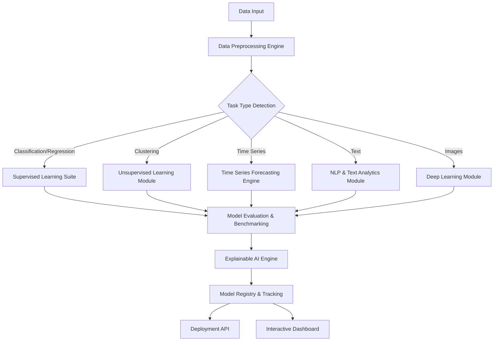
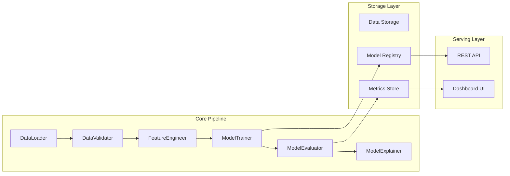
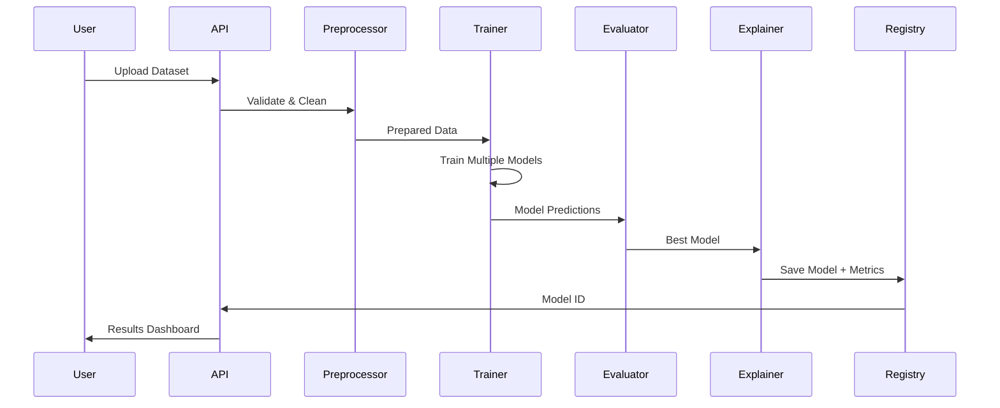

# Unified AI Analytics Platform - Project Execution Blueprint

## 1. Project Overview

### Problem Statement
Data scientists and ML engineers often need to:
- Experiment with multiple ML algorithms on new datasets
- Compare model performance across different paradigms
- Understand model predictions through interpretability tools
- Deploy the best-performing models with minimal friction

Current solutions are fragmented across multiple tools and frameworks, requiring significant integration effort.

### Solution
The Unified AI Analytics Platform is an end-to-end machine learning benchmarking system that:
- Automatically preprocesses and validates datasets
- Trains and evaluates 30+ machine learning algorithms across 6 paradigms
- Provides explainability through SHAP, LIME, and other XAI techniques
- Offers automated hyperparameter optimization
- Deploys models via REST API
- Visualizes results through interactive dashboards

### End Goal
A production-ready, modular ML platform that demonstrates:
- Deep understanding of ML algorithms and their applications
- Full-stack ML engineering capabilities (data → training → deployment)
- MLOps best practices
- Software engineering excellence

---

## 2. System Architecture

### High-Level Architecture



### Component Architecture



### Data Flow



---

## 3. Tech Stack & Dependencies

### Core Technologies

| Component | Technology | Version | Purpose |
|-----------|-----------|---------|---------|
| Language | Python | 3.9+ | Primary development language |
| Data Processing | Pandas, NumPy | Latest | Data manipulation |
| ML Framework | Scikit-learn | 1.3+ | Classical ML algorithms |
| Deep Learning | TensorFlow/Keras | 2.13+ | Neural networks |
| Deep Learning | PyTorch | 2.0+ | Advanced deep learning |
| Gradient Boosting | XGBoost, LightGBM, CatBoost | Latest | Ensemble methods |
| Time Series | Prophet, statsmodels | Latest | Forecasting |
| NLP | Transformers, spaCy | Latest | Text processing |
| AutoML | Optuna | 3.0+ | Hyperparameter optimization |
| Explainability | SHAP, LIME | Latest | Model interpretability |
| Experiment Tracking | MLflow | 2.8+ | Model versioning |
| API Framework | FastAPI | 0.100+ | REST API |
| Dashboard | Streamlit | 1.28+ | Interactive UI |
| Visualization | Matplotlib, Seaborn, Plotly | Latest | Charts and plots |
| Testing | pytest | 7.0+ | Unit testing |
| Code Quality | black, flake8, mypy | Latest | Linting and formatting |

### Dependency Management

```yaml
# environment.yml structure
name: unified-ai-platform
channels:
  - conda-forge
  - defaults
dependencies:
  - python=3.9
  - pandas
  - numpy
  - scikit-learn
  - pip
  - pip:
    - tensorflow
    - torch
    - xgboost
    - lightgbm
    - catboost
    - optuna
    - shap
    - lime
    - mlflow
    - fastapi
    - streamlit
```

---

## 4. Module-by-Module Build Plan

### Module 1: Data Preprocessing Engine

**Location:** `src/preprocessing/`

**Components:**
- `data_loader.py` - Load data from CSV, JSON, Parquet, SQL databases
- `data_validator.py` - Validate schema, check data quality, detect anomalies
- `feature_engineer.py` - Feature scaling, encoding, transformation
- `missing_handler.py` - Imputation strategies (mean, median, KNN, MICE)
- `outlier_detector.py` - IQR, Z-score, Isolation Forest methods

**Key Functions:**
```python
class DataPreprocessor:
    def load_data(self, source: str) -> pd.DataFrame
    def validate_schema(self, df: pd.DataFrame) -> ValidationReport
    def handle_missing_values(self, df: pd.DataFrame, strategy: str) -> pd.DataFrame
    def detect_outliers(self, df: pd.DataFrame, method: str) -> pd.DataFrame
    def engineer_features(self, df: pd.DataFrame, config: dict) -> pd.DataFrame
    def split_data(self, df: pd.DataFrame, test_size: float) -> Tuple[...]
```

**Deliverables:**
- Automated data profiling reports
- Feature engineering pipeline
- Train/validation/test splits

---

### Module 2: Supervised Learning Suite

**Location:** `src/models/supervised/`

**Algorithms to Implement:**

**Regression:**
- Linear Regression
- Ridge/Lasso/ElasticNet
- Polynomial Regression
- Support Vector Regression (SVR)
- Decision Tree Regressor
- Random Forest Regressor
- Gradient Boosting Regressor
- XGBoost Regressor
- LightGBM Regressor
- CatBoost Regressor

**Classification:**
- Logistic Regression
- K-Nearest Neighbors (KNN)
- Naive Bayes (Gaussian, Multinomial, Bernoulli)
- Support Vector Machines (SVM)
- Decision Tree Classifier
- Random Forest Classifier
- Gradient Boosting Classifier
- XGBoost Classifier
- LightGBM Classifier
- CatBoost Classifier

**Structure:**
```python
class BaseModel(ABC):
    @abstractmethod
    def train(self, X_train, y_train) -> None

    @abstractmethod
    def predict(self, X_test) -> np.ndarray

    @abstractmethod
    def evaluate(self, X_test, y_test) -> dict

class SupervisedTrainer:
    def train_all_models(self, X_train, y_train, task_type: str) -> Dict[str, BaseModel]
    def get_best_model(self, models: dict, metric: str) -> BaseModel
```

---

### Module 3: Deep Learning Module

**Location:** `src/models/deep_learning/`

**Architectures:**
- Feedforward Neural Networks (Tabular data)
- Convolutional Neural Networks (Image data)
- Recurrent Neural Networks - LSTM/GRU (Sequence data)
- Autoencoders (Anomaly detection, dimensionality reduction)

**Components:**
- `neural_network_builder.py` - Dynamic network architecture creation
- `cnn_models.py` - Image classification models
- `rnn_models.py` - Sequence models
- `autoencoder.py` - Unsupervised feature learning

**Key Features:**
- Early stopping
- Learning rate scheduling
- Batch normalization
- Dropout regularization
- TensorBoard integration

---

### Module 4: Unsupervised Learning Module

**Location:** `src/models/unsupervised/`

**Algorithms:**

**Clustering:**
- K-Means
- DBSCAN
- Hierarchical Clustering
- Gaussian Mixture Models (GMM)
- OPTICS
- Mean Shift

**Dimensionality Reduction:**
- Principal Component Analysis (PCA)
- t-SNE
- UMAP
- Linear Discriminant Analysis (LDA)
- Autoencoders (from deep learning module)

**Anomaly Detection:**
- Isolation Forest
- One-Class SVM
- Local Outlier Factor (LOF)

---

### Module 5: Time Series Forecasting Engine

**Location:** `src/models/time_series/`

**Algorithms:**
- ARIMA/SARIMA
- Prophet (Facebook)
- Exponential Smoothing
- LSTM for Time Series
- GRU for Time Series
- Temporal Fusion Transformers

**Components:**
- `time_series_preprocessor.py` - Seasonality decomposition, stationarity tests
- `forecasters.py` - Implementation of forecasting models
- `evaluator.py` - MAE, RMSE, MAPE metrics

---

### Module 6: NLP & Text Analytics Module

**Location:** `src/models/nlp/`

**Approaches:**

**Classical:**
- TF-IDF + Logistic Regression
- TF-IDF + SVM
- Word2Vec + Classical ML
- GloVe + Classical ML

**Deep Learning:**
- LSTM for text classification
- CNN for text classification
- Transformer-based models (BERT, RoBERTa, DistilBERT)

**Components:**
- `text_preprocessor.py` - Tokenization, stopword removal, lemmatization
- `embeddings.py` - Word2Vec, GloVe, BERT embeddings
- `text_classifiers.py` - Classification models
- `sentiment_analyzer.py` - Specialized sentiment analysis

---

### Module 7: Model Evaluation & Benchmarking

**Location:** `src/evaluation/`

**Metrics Implementation:**

**Classification:**
- Accuracy, Precision, Recall, F1-Score
- ROC-AUC, PR-AUC
- Confusion Matrix
- Classification Report
- Matthews Correlation Coefficient

**Regression:**
- Mean Absolute Error (MAE)
- Mean Squared Error (MSE)
- Root Mean Squared Error (RMSE)
- R² Score
- Mean Absolute Percentage Error (MAPE)

**Clustering:**
- Silhouette Score
- Davies-Bouldin Index
- Calinski-Harabasz Index
- Adjusted Rand Index

**Components:**
```python
class ModelEvaluator:
    def evaluate_classification(self, y_true, y_pred) -> dict
    def evaluate_regression(self, y_true, y_pred) -> dict
    def evaluate_clustering(self, X, labels) -> dict
    def compare_models(self, results: List[dict]) -> pd.DataFrame
    def generate_evaluation_report(self, results: dict) -> Report
```

---

### Module 8: Explainable AI (XAI) Engine

**Location:** `src/explainability/`

**Techniques:**
- SHAP (SHapley Additive exPlanations)
  - TreeExplainer for tree-based models
  - DeepExplainer for neural networks
  - KernelExplainer for any model
- LIME (Local Interpretable Model-agnostic Explanations)
- Partial Dependence Plots
- Individual Conditional Expectation (ICE) plots
- Feature Importance
- Integrated Gradients (for deep learning)

**Components:**
```python
class ModelExplainer:
    def explain_prediction(self, model, instance, method: str) -> Explanation
    def get_feature_importance(self, model, X) -> dict
    def generate_shap_values(self, model, X) -> np.ndarray
    def plot_dependence(self, model, X, feature: str) -> Figure
    def explain_local(self, model, instance, method: str) -> LocalExplanation
```

---

### Module 9: Automated Model Selection (AutoML)

**Location:** `src/automl/`

**Features:**
- Automated algorithm selection based on dataset characteristics
- Hyperparameter optimization using Optuna
- Neural architecture search
- Feature selection optimization
- Ensemble model creation

**Components:**
```python
class AutoMLEngine:
    def detect_task_type(self, y) -> str
    def suggest_algorithms(self, X, y, task_type: str) -> List[str]
    def optimize_hyperparameters(self, model, X, y, n_trials: int) -> dict
    def auto_train(self, X, y) -> BestModel
    def create_ensemble(self, models: List) -> EnsembleModel
```

**Optimization Strategy:**
- Bayesian optimization via Optuna
- Cross-validation for robust evaluation
- Early stopping for efficiency
- Parallel trials when possible

---

### Module 10: Deployment & Dashboard

**Location:** `src/api/` and `src/dashboard/`

**REST API (FastAPI):**

Endpoints:
```
POST   /api/v1/upload          - Upload dataset
POST   /api/v1/preprocess      - Trigger preprocessing
POST   /api/v1/train           - Start training pipeline
GET    /api/v1/models          - List all trained models
GET    /api/v1/models/{id}     - Get model details
POST   /api/v1/predict         - Make predictions
GET    /api/v1/explain/{id}    - Get model explanations
GET    /api/v1/metrics/{id}    - Get evaluation metrics
DELETE /api/v1/models/{id}     - Delete model
```

**Dashboard (Streamlit):**

Pages:
1. Home - Overview and quick stats
2. Data Upload - Upload and preview datasets
3. Preprocessing - Configure preprocessing pipeline
4. Model Training - Select algorithms and train
5. Model Comparison - Compare model performances
6. Explainability - Visualize SHAP/LIME explanations
7. Predictions - Make predictions on new data
8. Experiment Tracking - MLflow integration

**MLflow Integration:**
- Track all experiments
- Log parameters, metrics, and artifacts
- Version control for models
- Model registry for production deployment

---

## 5. Simulation & Validation Plan

### Test Datasets

| Dataset | Task Type | Purpose |
|---------|-----------|---------|
| Iris | Classification | Basic multi-class classification |
| Boston Housing | Regression | Regression benchmarking |
| MNIST | Image Classification | CNN validation |
| IMDB Reviews | Text Classification | NLP pipeline testing |
| Stock Prices | Time Series | Forecasting validation |
| Customer Segmentation | Clustering | Unsupervised learning |

### Validation Checklist

**Phase 1: Unit Testing**
- [ ] Each preprocessing function tested with edge cases
- [ ] All models train without errors
- [ ] Evaluation metrics calculated correctly
- [ ] API endpoints return expected responses

**Phase 2: Integration Testing**
- [ ] End-to-end pipeline from upload to prediction
- [ ] Cross-module data flow validation
- [ ] MLflow tracking integration
- [ ] Dashboard displays correct information

**Phase 3: Performance Testing**
- [ ] Training time benchmarks
- [ ] API response time under load
- [ ] Memory usage profiling
- [ ] Concurrent request handling

**Phase 4: Validation Testing**
- [ ] Model predictions match expected accuracy
- [ ] SHAP values sum to prediction difference
- [ ] Cross-validation scores are stable
- [ ] Hyperparameter optimization improves performance

---

## 6. Testing & Deployment Strategy

### Testing Framework

```
tests/
├── unit/
│   ├── test_preprocessing.py
│   ├── test_models.py
│   ├── test_evaluation.py
│   └── test_explainability.py
├── integration/
│   ├── test_pipeline.py
│   ├── test_api.py
│   └── test_dashboard.py
├── performance/
│   ├── test_training_speed.py
│   └── test_api_load.py
└── conftest.py
```

**Testing Standards:**
- Minimum 80% code coverage
- All public methods have tests
- Edge cases and error handling covered
- Fixtures for common test data

### Continuous Integration

**GitHub Actions Workflow:**
```yaml
name: CI/CD Pipeline
on: [push, pull_request]
jobs:
  test:
    - Install dependencies
    - Run linting (flake8, black, mypy)
    - Run unit tests
    - Run integration tests
    - Generate coverage report

  build:
    - Build Docker image
    - Push to registry

  deploy:
    - Deploy to staging (on main branch)
    - Run smoke tests
```

### Deployment Options

**Local Deployment:**
```bash
# Start API server
uvicorn src.api.main:app --reload

# Start dashboard
streamlit run src/dashboard/app.py
```

**Docker Deployment:**
```dockerfile
FROM python:3.9-slim
WORKDIR /app
COPY requirements.txt .
RUN pip install -r requirements.txt
COPY . .
CMD ["uvicorn", "src.api.main:app", "--host", "0.0.0.0"]
```

**Cloud Deployment:**
- AWS: ECS/EKS with ECR
- Azure: Container Instances
- GCP: Cloud Run

---

## 7. Data Sources & Structure

### Input Data Format

**Supported Formats:**
- CSV, TSV
- JSON, JSONL
- Parquet
- Excel
- SQL databases (PostgreSQL, MySQL, SQLite)
- HDF5

**Expected Structure:**
```
{
  "data": DataFrame or path,
  "target_column": str,
  "task_type": "classification" | "regression" | "clustering" | "forecasting" | "nlp",
  "config": {
    "test_size": 0.2,
    "random_state": 42,
    "preprocessing": {...},
    "models_to_train": [...]
  }
}
```

### Output Structure

**Model Artifacts:**
```
models/
├── model_id_123/
│   ├── model.pkl
│   ├── metadata.json
│   ├── metrics.json
│   ├── shap_values.npy
│   └── plots/
│       ├── confusion_matrix.png
│       ├── roc_curve.png
│       └── shap_summary.png
```

**Experiment Tracking:**
- MLflow creates `mlruns/` directory
- Each experiment logged with unique ID
- Parameters, metrics, and artifacts versioned

---

## 8. Version Control Strategy

### Branch Strategy

```
main              - Production-ready code
├── develop       - Integration branch
├── feature/*     - New features
├── fix/*         - Bug fixes
├── docs/*        - Documentation updates
└── refactor/*    - Code improvements
```

### Commit Guidelines

**Format:**
```
<type>(<scope>): <subject>

<body>

<footer>
```

**Types:**
- `feat`: New feature
- `fix`: Bug fix
- `docs`: Documentation
- `style`: Formatting
- `refactor`: Code restructuring
- `test`: Adding tests
- `chore`: Maintenance

**Example:**
```
feat(preprocessing): add MICE imputation for missing values

Implemented Multiple Imputation by Chained Equations (MICE) as an
advanced missing value imputation strategy. This provides better
handling of missing data patterns compared to simple mean/median.

Closes #42
```

### Release Versioning

Follow Semantic Versioning (SemVer): `MAJOR.MINOR.PATCH`

- `MAJOR`: Breaking changes
- `MINOR`: New features (backward compatible)
- `PATCH`: Bug fixes

---

## 9. Failure Recovery / Continuation Plan

### Checkpoint System

**Save State After Each Phase:**
1. After data preprocessing → Save processed data
2. After model training → Save model checkpoints
3. After evaluation → Save metrics and reports
4. After explainability → Save SHAP values and plots

**Resume Mechanism:**
```python
class PipelineCheckpoint:
    def save_checkpoint(self, phase: str, data: dict) -> None
    def load_checkpoint(self, phase: str) -> dict
    def list_checkpoints(self) -> List[str]
    def resume_from(self, phase: str) -> None
```

### Recovery Procedures

**If Training Interrupted:**
```python
# Check for existing checkpoints
if checkpoint_exists("model_training"):
    models = load_checkpoint("model_training")
    # Resume training only incomplete models
else:
    # Start fresh
```

**If Data Processing Fails:**
- Log error details
- Save partial results
- Provide clear error messages
- Suggest corrections

**If Deployment Fails:**
- Rollback to previous version
- Check logs for root cause
- Verify dependencies
- Test in isolation

### Documentation Trail

**Keep Detailed Logs:**
```
logs/
├── preprocessing.log
├── training.log
├── evaluation.log
├── api.log
└── dashboard.log
```

**Progress Tracking:**
- Use PLAN.md checkboxes for completed items
- Update CHANGELOG.md for each milestone
- Document decisions in docs/DECISIONS.md

---

## 10. Implementation Timeline

### Phase 1: Foundation (Week 1-2)
- [ ] Project structure setup
- [ ] Core utilities and base classes
- [ ] Data preprocessing engine
- [ ] Unit tests for preprocessing

### Phase 2: Model Implementation (Week 3-4)
- [ ] Supervised learning suite
- [ ] Unsupervised learning module
- [ ] Deep learning module
- [ ] Model evaluation framework

### Phase 3: Advanced Features (Week 5-6)
- [ ] Time series forecasting
- [ ] NLP module
- [ ] Explainability engine
- [ ] AutoML capabilities

### Phase 4: Deployment (Week 7)
- [ ] FastAPI implementation
- [ ] Streamlit dashboard
- [ ] MLflow integration
- [ ] Docker containerization

### Phase 5: Testing & Documentation (Week 8)
- [ ] Comprehensive testing
- [ ] Documentation completion
- [ ] README and examples
- [ ] CI/CD pipeline

### Phase 6: Refinement (Week 9-10)
- [ ] Performance optimization
- [ ] Visual polish
- [ ] Final testing
- [ ] Release preparation

---

## 11. Success Metrics

**Technical Metrics:**
- 30+ ML algorithms implemented
- 80%+ test coverage
- API response time < 200ms
- Dashboard load time < 3s
- Successfully handles datasets up to 100k rows

**Quality Metrics:**
- All models achieve baseline accuracy on test datasets
- SHAP explanations mathematically valid
- Zero critical bugs in production
- Code quality score > 8/10 (SonarQube)

**Professional Metrics:**
- Production-grade documentation
- Clean, modular architecture
- Recruiter-friendly README
- Deployable to cloud platforms

---

## 12. Next Steps After Completion

**Enhancements:**
1. Add fairness/bias detection (AIF360, Fairlearn)
2. Implement continual learning pipeline
3. Add model monitoring and drift detection
4. Support for more data types (audio, video)
5. Multi-modal learning capabilities
6. Federated learning support

**Community Building:**
1. Create tutorial notebooks
2. Write blog posts
3. Create video walkthroughs
4. Present at meetups
5. Contribute to related open-source projects

**Career Leverage:**
1. Portfolio showcase piece
2. Technical blog content
3. Conference talk material
4. Open-source contribution example
5. System design interview preparation

---

## Appendix A: File Structure

```
unified-ai-platform/
├── .github/
│   └── workflows/
│       └── ci.yml
├── docs/
│   ├── PLAN.md
│   ├── API_REFERENCE.md
│   ├── SYSTEM_DESIGN.md
│   ├── TESTING_GUIDE.md
│   └── visuals/
├── src/
│   ├── __init__.py
│   ├── preprocessing/
│   ├── models/
│   │   ├── supervised/
│   │   ├── unsupervised/
│   │   ├── deep_learning/
│   │   ├── time_series/
│   │   └── nlp/
│   ├── evaluation/
│   ├── explainability/
│   ├── automl/
│   ├── api/
│   ├── dashboard/
│   └── utils/
├── tests/
│   ├── unit/
│   ├── integration/
│   └── performance/
├── notebooks/
│   └── examples/
├── data/
│   ├── raw/
│   ├── processed/
│   └── sample/
├── models/
├── logs/
├── mlruns/
├── .gitignore
├── README.md
├── requirements.txt
├── environment.yml
├── setup.py
├── Dockerfile
├── docker-compose.yml
├── CONTRIBUTING.md
├── CODE_OF_CONDUCT.md
├── LICENSE
└── CHANGELOG.md
```

---

## Appendix B: Key Design Decisions

**Why Optuna over GridSearch?**
- More efficient Bayesian optimization
- Pruning of unpromising trials
- Better parallelization support
- State-of-the-art hyperparameter tuning

**Why FastAPI over Flask?**
- Automatic API documentation (OpenAPI)
- Type hints and validation (Pydantic)
- Better async support
- Higher performance

**Why Streamlit for Dashboard?**
- Rapid development
- Python-native
- Beautiful defaults
- Easy deployment

**Why MLflow for Tracking?**
- Industry standard
- Model registry capabilities
- Easy comparison of experiments
- Deployment flexibility

---

This plan serves as the complete blueprint for building the Unified AI Analytics Platform. Each section can be implemented independently, and progress can be tracked through checkboxes. The plan is designed to be resumable at any point, ensuring continuity even if development is interrupted.
